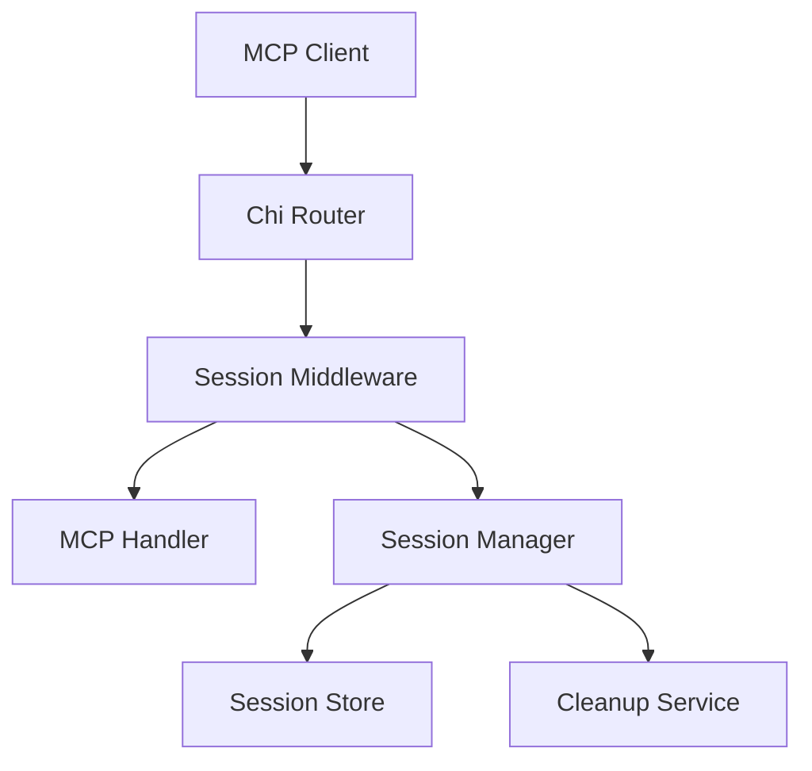
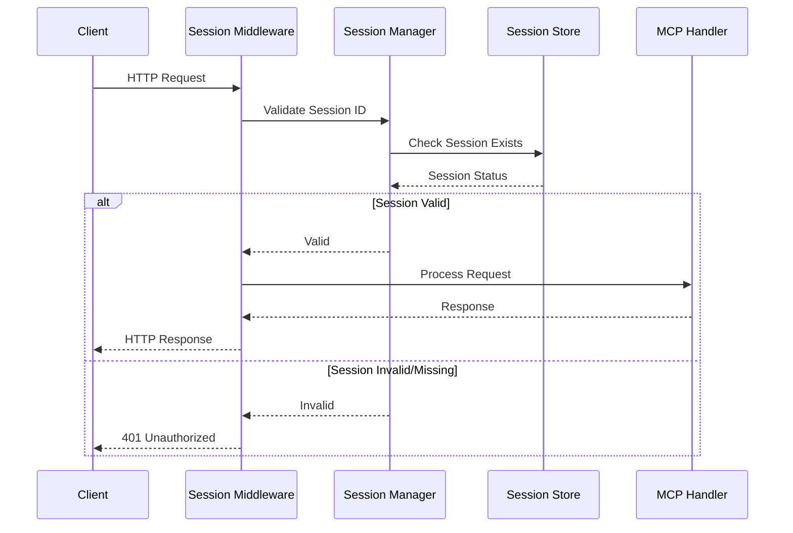
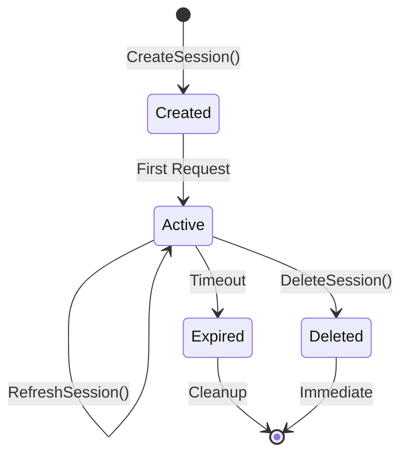

# Session Management Design Document

## Overview

The session management system will be implemented as a middleware component that integrates with the existing HTTP MCP server architecture. It will provide secure session tracking, validation, and lifecycle management for all MCP client connections. The design follows Go best practices for concurrent programming and integrates seamlessly with the existing chi router and MCP handler architecture.

## Architecture

### High-Level Architecture



### Component Interaction Flow



## Components and Interfaces

### 1. Session Manager

The core component responsible for session lifecycle management.

```go
type SessionManager interface {
    // CreateSession generates a new session ID and stores it
    CreateSession(ctx context.Context) (string, error)
    
    // ValidateSession checks if a session ID is valid and active
    ValidateSession(ctx context.Context, sessionID string) error
    
    // RefreshSession updates the last activity timestamp
    RefreshSession(ctx context.Context, sessionID string) error
    
    // DeleteSession removes a session from the store
    DeleteSession(ctx context.Context, sessionID string) error
    
    // CleanupExpiredSessions removes all expired sessions
    CleanupExpiredSessions(ctx context.Context) error
}
```

### 2. Session Store

Thread-safe storage for session data with configurable backends.

```go
type SessionStore interface {
    // Set stores a session with expiration
    Set(ctx context.Context, sessionID string, session *Session) error
    
    // Get retrieves a session by ID
    Get(ctx context.Context, sessionID string) (*Session, error)
    
    // Delete removes a session
    Delete(ctx context.Context, sessionID string) error
    
    // List returns all active sessions (for cleanup)
    List(ctx context.Context) ([]*Session, error)
    
    // Close cleans up resources
    Close() error
}
```

### 3. Session Data Model

```go
type Session struct {
    ID          string    `json:"id"`
    CreatedAt   time.Time `json:"created_at"`
    LastAccess  time.Time `json:"last_access"`
    ExpiresAt   time.Time `json:"expires_at"`
    ClientInfo  ClientInfo `json:"client_info"`
}

type ClientInfo struct {
    RemoteAddr string `json:"remote_addr"`
    UserAgent  string `json:"user_agent"`
}
```

### 4. Session Middleware

HTTP middleware that integrates with the chi router.

```go
type SessionMiddleware struct {
    manager SessionManager
    logger  zerolog.Logger
    config  MiddlewareConfig
}

type MiddlewareConfig struct {
    SessionTimeout    time.Duration
    CleanupInterval   time.Duration
    RequireSession    bool
    ExcludedPaths     []string
}
```

### 5. Memory Store Implementation

Initial implementation using in-memory storage with mutex protection.

```go
type MemoryStore struct {
    sessions map[string]*Session
    mutex    sync.RWMutex
    logger   zerolog.Logger
}
```

## Data Models

### Session Lifecycle States



### Session ID Generation

- Use `crypto/rand` for cryptographically secure random generation
- Format: Base64-encoded 32-byte random value
- Prefix with timestamp for debugging (optional)
- Example: `sess_1704067200_AbCdEfGhIjKlMnOpQrStUvWxYz1234567890`

## Error Handling

### Error Types

```go
type SessionError struct {
    Code    string
    Message string
    Cause   error
}

const (
    ErrSessionNotFound    = "SESSION_NOT_FOUND"
    ErrSessionExpired     = "SESSION_EXPIRED"
    ErrSessionInvalid     = "SESSION_INVALID"
    ErrSessionGeneration  = "SESSION_GENERATION_FAILED"
    ErrSessionStorage     = "SESSION_STORAGE_ERROR"
)
```

### HTTP Error Responses

- **400 Bad Request**: Missing Mcp-Session-Id header
- **401 Unauthorized**: Invalid or expired session ID
- **500 Internal Server Error**: Session generation or storage failures

### Error Response Format

```json
{
    "error": {
        "code": "SESSION_EXPIRED",
        "message": "Session has expired",
        "details": {
            "session_id": "sess_1704067200_...",
            "expired_at": "2024-01-01T12:00:00Z"
        }
    }
}
```

## Testing Strategy

### Unit Tests

1. **Session Manager Tests**
   - Session creation and validation
   - Expiration handling
   - Concurrent access safety
   - Error conditions

2. **Session Store Tests**
   - CRUD operations
   - Thread safety
   - Memory cleanup
   - Edge cases

3. **Middleware Tests**
   - Header validation
   - Request routing
   - Error responses
   - Path exclusions

### Integration Tests

1. **End-to-End Flow Tests**
   - Complete session lifecycle
   - MCP protocol integration
   - Multiple concurrent clients
   - Session timeout scenarios

2. **Performance Tests**
   - High concurrent session creation
   - Memory usage under load
   - Cleanup performance
   - Session validation latency

### Test Data and Mocking

```go
type MockSessionStore struct {
    sessions map[string]*Session
    errors   map[string]error
}

func NewTestSession() *Session {
    return &Session{
        ID:         "test_session_123",
        CreatedAt:  time.Now(),
        LastAccess: time.Now(),
        ExpiresAt:  time.Now().Add(time.Hour),
        ClientInfo: ClientInfo{
            RemoteAddr: "127.0.0.1:12345",
            UserAgent:  "test-client/1.0",
        },
    }
}
```

## Implementation Details

### Configuration

```go
type Config struct {
    SessionTimeout    time.Duration `yaml:"session_timeout" default:"1h"`
    CleanupInterval   time.Duration `yaml:"cleanup_interval" default:"5m"`
    SecureGeneration  bool          `yaml:"secure_generation" default:"true"`
    LogLevel          string        `yaml:"log_level" default:"info"`
}
```

### Logging Strategy

- Use structured logging with zerolog (consistent with existing codebase)
- Log levels:
  - **DEBUG**: Session operations, validation details
  - **INFO**: Session creation, cleanup events
  - **WARN**: Invalid session attempts, cleanup issues
  - **ERROR**: Storage failures, generation errors

### Metrics and Monitoring

```go
type SessionMetrics struct {
    ActiveSessions    int64
    TotalCreated      int64
    ValidationErrors  int64
    CleanupCount      int64
    LastCleanup       time.Time
}
```

### Integration Points

1. **Chi Router Integration**
   - Add middleware to router chain before MCP handler
   - Configure excluded paths (health checks, static files)

2. **MCP Handler Integration**
   - Session ID available in request context
   - No changes required to existing MCP logic

3. **Existing Middleware Compatibility**
   - Works with existing CORS, logging, recovery middleware
   - Maintains request/response flow

### Security Considerations

1. **Session ID Security**
   - Cryptographically secure random generation
   - Sufficient entropy (256 bits)
   - No predictable patterns

2. **Storage Security**
   - In-memory storage for initial implementation
   - No persistent storage of sensitive data
   - Automatic cleanup on server restart

3. **Header Validation**
   - Strict session ID format validation
   - Protection against header injection
   - Rate limiting considerations (future enhancement)

### Performance Considerations

1. **Memory Management**
   - Efficient session storage with cleanup
   - Configurable session limits
   - Memory usage monitoring

2. **Concurrency**
   - Read-write mutex for session store
   - Minimal lock contention
   - Non-blocking cleanup operations

3. **Scalability**
   - Stateless middleware design
   - Pluggable storage backends
   - Horizontal scaling ready (with external store)